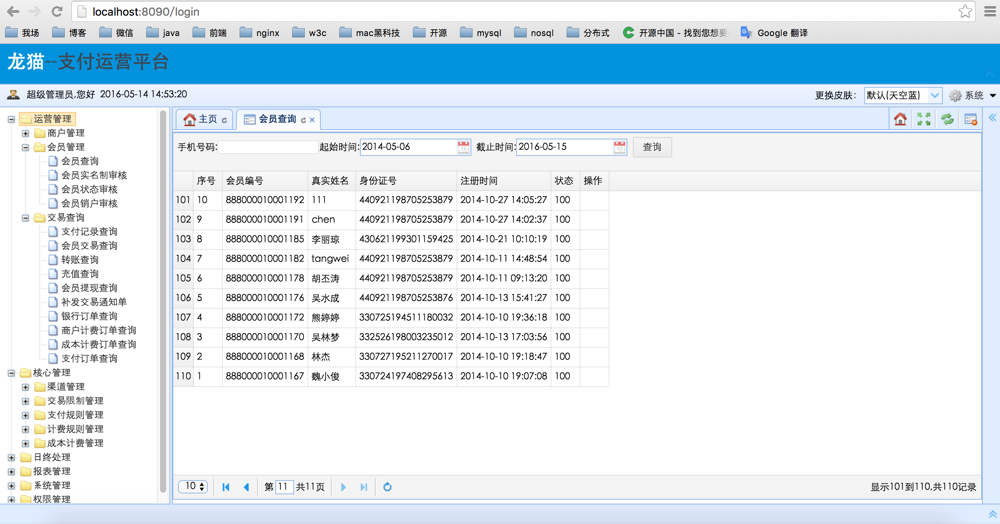
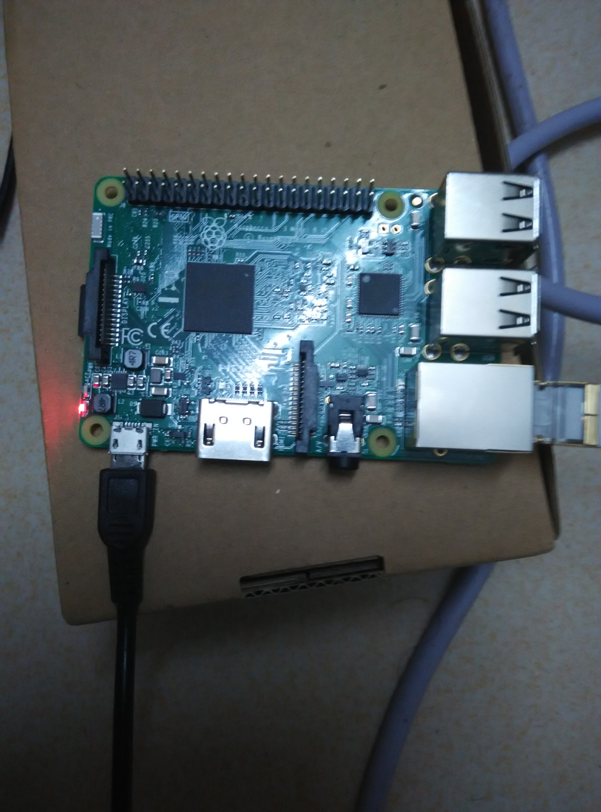
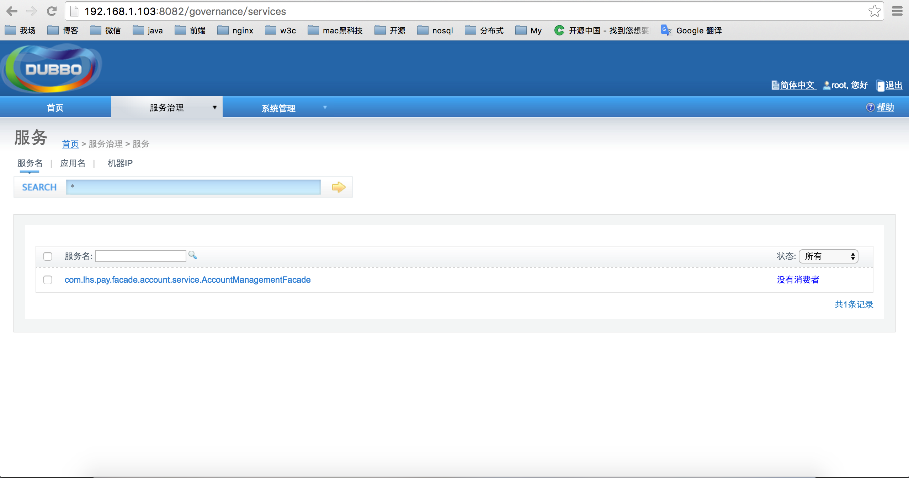

### 简易支付系统

# 
| 工程        |   说明           |
| ------------- |:-------------:|
| pay-common      | 公共工程,所有项目均可引用|
| pay-common-config      | 公共配置工程|
| pay-common-core | 公共核心工程,service 工程共用  |    
| pay-common-web | 公共核心工程,web 工程共用  |    
| 						|				              |
| pay-facade-user |	用户服务接口   |
| pay-facade-account |	账户服务接口   |
| pay-service-user| 用户服务       |
| pay-service-account| 账户服务    |
| pay-web-boss    | 运营管理系统    |
| pay-web-portal  | 门户系统        |

### 技术架构

#### 管理
* maven依赖和项目管理
* git版本控制
* Jenkins持续构建

#### 后端
* IoC容器 Spring
* web框架 SpringMvc
* orm框架 Mybatis
* rpc框架 Dubbo
* 任务调度框架 quartz
* 缓存 redis
* 数据源 druid
* 日志 slf4j+log4j2
* Json jackson
* kaptcha 验证码
* jsp 模板视图

#### 前端
* jquery js框架
* easyui 界面框架
* zTree 树框架

##### 运营管理后台

##### 服务和注册中心、dubbo-admin后台等放在树莓派上

#### 商户账户管理中心
![](media/merchant-center.png